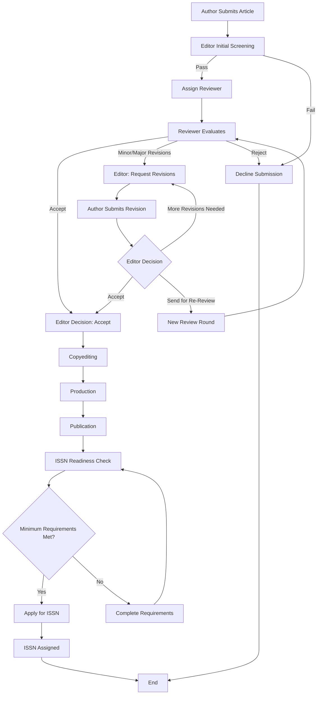

# 📘 OJS Editorial Playbook

*A basic and practical guide for managing journals using Open Journal Systems (OJS)*

---

## 🎯 Purpose

This repository provides a **simple, reusable, and practical guide** for teams managing academic journals using **Open Journal Systems (OJS)**.

It is designed to help:

* New editorial teams get started quickly
* Existing teams improve their workflow
* Institutions adopt consistent and efficient journal practices

This playbook focuses on **general OJS workflows and best practices**, avoiding any institution-specific policies.

---

## 🧭 What You’ll Find Here

### 👥 Roles & Responsibilities

Clear, concise descriptions of what each role does:

* Editor
* Reviewer
* Author

---

### 🔄 Editorial Workflows

Step-by-step guides and flowcharts covering:

* Submission → Review → Publication
* Peer review process
* Revision cycles

---

### 🛠️ Practical How-To Guides

Actionable instructions for common OJS tasks:

* Assigning reviewers
* Handling “Needs Editor” submissions
* Making editorial decisions
* Publishing articles

---

### 📊 Visual Flowcharts

Simple diagrams to help teams understand the full journal lifecycle.

---

## 🚀 Quick Start

If you're new to OJS workflows, start here:

1. Read **Roles Overview** → understand responsibilities
2. Review **Submission to Publication Workflow**
3. Explore **How-To Guides** for actual system actions

---

## 🔁 Example Workflow

---

## 🧪 Optional: Training Mode (Role Rotation)

For learning and workshops, teams can simulate the full editorial process:

* Authors act as Reviewers
* Reviewers act as Editors
* Editors oversee the full cycle

This helps build a deeper understanding of the system and improves collaboration.

---

## ⚖️ Scope & Limitations

This repository:

* ✅ Focuses on **generic OJS usage and workflows**
* ✅ Is safe to reuse across institutions
* ❌ Only includes the basic user roles

---

## 🤝 Contributing

Contributions are welcome!

You can help by:

* Improving guides
* Adding clearer workflows
* Sharing best practices
* Fixing unclear instructions

Feel free to fork and submit a pull request.

---

## 💡 Vision

This project aims to become a **lightweight, open reference** for OJS teams—especially for schools and organizations starting their journey in academic publishing.

---

## 📄 License

This project is licensed under the MIT License — see the [LICENSE](LICENSE) file for details.

---

## 🎓 Credits

This project is based on workflows and features from **Open Journal Systems (OJS)**, developed by the Public Knowledge Project (PKP).

Special thanks to PKP for their work in supporting open-access publishing and providing a robust platform for academic journals worldwide.

* Website: https://pkp.sfu.ca/ojs/

This repository is an independent guide and is not officially affiliated with PKP.

---

*Start small. Improve continuously. Document everything.*
